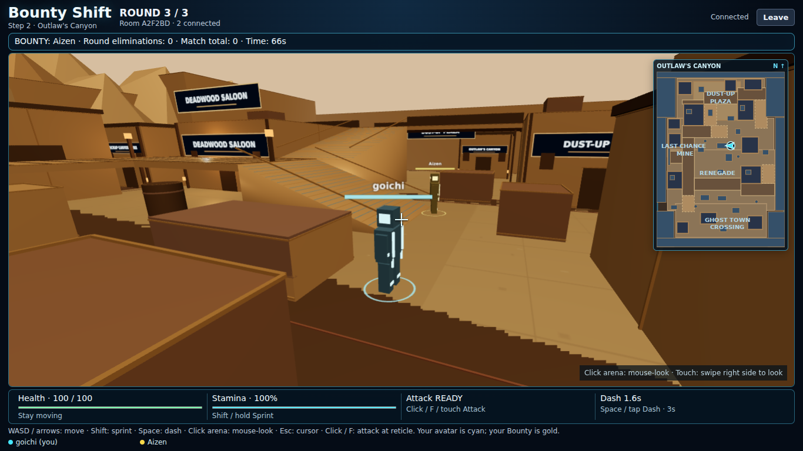
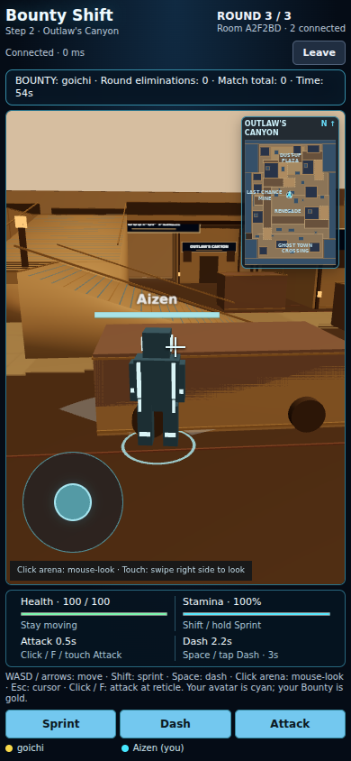

# Bounty Shift — Step 2, Stage 3: Outlaw's Canyon

Map 4 extends the current four-map registry and existing renderer. Central Plaza, Scorched Point and Aerie Sky-Port definitions are preserved, as are authoritative rotation, three-round matches, Aerie variants, combat, movement/controller, room flow and responsive UI. No Map 5 or new mode is included.




## Map roster and authoritative rotation

| Map ID | Display name | Environment |
| --- | --- | --- |
| `central_plaza` | Central Plaza | Cyan/magenta city; guaranteed Round 1 |
| `scorched_point` | Scorched Point | Volcanic industrial/lava |
| `aerie_sky_port` | Aerie Sky-Port | Sky platforms; server-selected Day/Night |
| `outlaws_canyon` | Outlaw's Canyon | Warm dusty late-afternoon canyon town |

Only `shared/map.ts` registration is extended. The existing `selectRoundMap` is unchanged: Round 1 always Central Plaza; later rounds select from registered maps excluding the immediate previous map when alternatives exist. The server's cryptographic random index determines one shared selection. Map count does not change the three-round match length.

The existing server selects `nextMapId` and `nextMapVariant` during intermission. Canyon has no variants, so `selectMapVariant` returns null without drawing randomness. Aerie alone retains Day/Night. At round start the server activates map/variant, resets health/round state and places players at that map's spawns before broadcasting. Identity, host, membership and match score persist. Reconnect packets carry the current map and state. Clients cannot select maps or variants.

No server, rotation-helper, combat or controller rewrite was necessary. The scene uses its existing map-ID lifecycle; old geometry/materials/textures/instances and the renderer are disposed when replaced. The map definition used for collision, spawn, minimap and camera solids changes together. Canyon has no clouds, lava, dome props or variant lighting.

## Outlaw's Canyon layout

The 1900 × 2600 map uses an irregular supported-ground union and solid cliff volumes instead of an empty enclosing rectangle. Its long north–south street branches into alleys and raised routes.

| Region | Playable role |
| --- | --- |
| Dust-Up Plaza | Northern open junction with irregular adobe storefronts, cover and access around the saloon |
| Deadwood Saloon | Main landmark with wood facade, shutters, porch, lanterns, usable balcony/roof and upper bridge |
| Last Chance Mine | Compact western mining pocket with timber/scrap headframes, track marks, cover and raised overlook; no underground maze |
| Scrap Canyon Mine | World-building sign on the adjacent mining store, part of the same mine district |
| West Renegade | Lower western roof/outpost beside the mine-side walkway |
| East Renegade | Asymmetric larger eastern outpost with its own stairs/landing and street-cover approaches |
| Ghost Town Crossing | Southern dusty junction, broken/storefront masses, gate sign, cart/barrel cover and multiple routes north |

The main street has short open stretches interrupted by cover and structures. Ground alleys offer alternate approaches. A connected raised route runs from the southern west stairs through the mine-side walkway to the saloon porch. Saloon stairs reach the selected rooftop and upper town bridge; the eastern roof stairs return to the ground. The Renegade bridge crosses the street at the middle height and links both outposts to another eastern descent. Major areas have ground and elevated alternatives.

## Traversal, collision and spawns

Height bands are 0 (streets), 80 (porches/outposts/mine overlook), and 160 (selected roofs/upper bridge), equivalent to 0 / 2.4 / 4.8 rendered metres. Stairs use existing smooth ramp surfaces. No jump, ladder, mantling, falling or hazard mechanics were added.

The same shared traversal code handles client prediction and server authority. Supported ground is the actual footprint union; blocks have vertical intervals; roofs have explicit support surfaces; ramps are solid wedges. Small movement/dash substeps prevent tunneling. Unsupported edges stop movement instead of letting players fall or escape. Canyon walls, buildings, cargo/cart bodies and barrel footprints have collision. Cosmetic slats/lanterns/roof patches stay light and avoid snagging.

Eight dedicated ground spawns are spread at (580,390), (1150,350), (260,1370), (1550,1285), (300,1900), (1500,2010), (550,2380), and (1200,2370). All are walkable and separated by over 250 units. The existing spawn-facing behavior points toward the map's plaza; respawn/protection uses the unchanged safe-spawn system. Capacity remains 2–6, with eight positions available for future scaling.

## Minimap, camera and mobile

The existing north-up SVG minimap draws Canyon's actual ground union, buildings, cover, ramps and decks from its map definition. Canyon geometry uses dusty brown/gold tones inside the existing cyan HUD frame. The local cyan arrow follows the same world X/Z and facing transform on all levels. Opponents are not revealed. The header/HUD read `Outlaw's Canyon` directly from map metadata.

Desktop pointer lock/mouse-look and camera-relative movement are unchanged. Camera obstruction uses the new map's solid meshes through the existing ray checks. Mobile joystick, right-side swipe and Sprint/Dash/Attack buttons are unchanged. The same no-scroll CSS and responsive minimap sizing are retained.

## Visual construction and performance

Canyon has adobe/wood/rust materials, corrugated roof strips, timber beams, windows/shutters, lantern accents, plank walkways, mine track marks, barrel/cart props, layered low-poly sandstone cliffs and distant mesas. Warm sunlight and dusty fog replace neon/sky/lava styling. No new lights beyond the existing small lighting budget, animated particle loops, texture downloads, volumetric effects, real-time reflections, physics scenery or dependencies were added.

Primitives/materials are reused; static boxes/trim/planks are instanced by material. Resource-disposal tests exercise repeated swaps among all four maps and both Aerie variants.

## Changed files for Map 4

| Files | Change |
| --- | --- |
| `shared/maps/outlaws-canyon.ts` (new) | Layout, collision, spawns, ramps/decks, districts, props and desert environment |
| `shared/maps/types.ts`, `shared/map.ts` | Canyon theme/cart/barrel types and registry entry |
| `src/environment.ts` | Canyon-only procedural architecture, props, cliffs and materials |
| `src/Minimap.tsx` | Canyon-specific geometry colors; existing layout/marker system preserved |
| `tests/outlaw.test.ts` (new), `tests/maps.test.ts`, `tests/environment.test.ts` | Canyon traversal/combat/authority tests, expanded pool and cleanup regression checks |
| `scripts/browser-smoke.mjs` | Canyon desktop/mobile, shared load, Aerie-to-Canyon cleanup and full-match checks |
| `README.md`, two `OUTLAW_CANYON_*_PREVIEW.png` (new) | Documentation and actual browser previews |

Both prior arena/controller code and map definitions remain intact. In particular, all three completed map files, `shared/map-rotation.ts`, `server/rooms.ts`, `shared/game.ts`, `shared/combat.ts`, `shared/traversal.ts`, `src/camera.ts`, `src/Arena.tsx`, `src/main.tsx`, `src/scene.ts`, `src/style.css`, dependencies and hosting configuration are unchanged from Map 3.

## Automated/local validation

Completed locally: production build passes; all 97 automated tests pass. Two independent Chromium/WebGL sessions pass rendering and controls on Central Plaza, Scorched Point, Aerie Day/Night and Canyon. Canyon checks include keyboard sprint up the porch stairs, reticle melee/synchronized damage, dash, minimap coordinate agreement, reload/reconnect, real multi-touch joystick + look + Sprint, touch Dash/Attack, final results/lobby reset and 11 viewport sizes without scrolling or clipped HUD. No page runtime errors were observed. Resource tests repeatedly replace all four maps and verify disposal.

A separate full-duration run passed in 280.2 seconds with three real WebSocket clients: Central Plaza → Scorched Point → Outlaw's Canyon, matching state/timers, reconnect, final results and a fresh Central Plaza opening. No map/position/timer fixtures were used in that run. After the final spawn clearance adjustment, the complete unit/browser suites were rerun. Hash checks confirm the three existing map definitions, rotation/server code, controller/camera, gameplay and responsive CSS remain unchanged.

These are local/headless checks, not a public Render deployment or physical-phone FPS measurement. Use the public checklist after uploading.

Run:

```sh
npm ci --include=dev
npm run build
npm test
npm run dev
```

For browser QA with an installed Chromium/WebGL-capable executable:

```sh
BOUNTY_QA_BROWSER=/path/to/chromium npm run test:browser
node --import tsx scripts/map-rotation-soak.mjs
```

Browser QA uses private round/position fixtures to cover every map and both Aerie variants reliably; this does not change production random rotation. The soak script uses three real WebSocket clients and unmodified 90-second rounds/intermissions, without map or position fixtures.

## Public-device Canyon acceptance checklist

1. Upload/deploy server and client together, refresh both devices and create a fresh room. Ready/start: Round 1 must always be Central Plaza.
2. Complete matches until Canyon is selected in a later round. Selection is random; it may require more than one match. Both clients must show the same round, Canyon HUD name/minimap and no Day/Night subtitle.
3. Walk/sprint/dash from Dust-Up Plaza through the settlement to Ghost Town Crossing. Try mine alleys, both outposts and central street flanks. Solid buildings and cliffs must block movement; open routes must remain usable.
4. Climb the saloon porch stairs and roof stairs, cross the upper bridge, and descend east. Climb the southern west walkway, visit the mine overlook, cross the Renegade bridge and descend east. Check no floor gaps, sinking, stuck edges or dash escape.
5. Rotate/look while stationary and moving on streets, ramps, rooftops, porches and alleys. Check camera compression near walls and remote body/facing/height consistency.
6. Check the minimap in north plaza, west mine, both outposts and south crossing. Its arrow must follow actual position/facing, with north above and no opponents revealed.
7. Fight: compare damage, KO, Bounty credit, round/match totals and protected safe respawn. Refresh while damaged/scored/elevated/KO. Identity, map and gameplay state must recover without duplicate bodies.
8. Mobile: joystick + right swipe + Sprint simultaneously; Dash and Attack; traverse bridges/alleys/ramps. Rotate phone and verify all HUD information/buttons fit without scrolling.
9. Finish the match, compare results, return to lobby and start fresh. Repeat with three or more players where practical. Inspect later Aerie rounds for correct shared Day/Night and no Canyon props; load the other maps to check cleanup and preservation.

## Remaining prototype limits

This is procedural map-first art, not final models/textures. The saloon and other large structures have solid bodies; the porch, selected roofs, balconies and mine pocket are playable, rather than full modeled interiors. Static haze/rocks replace costly dust effects. Camera comfort in tight angles, spawn fairness under human play and physical-phone FPS require public-device acceptance. No new hazard or environmental damage exists. WebGL/hardware acceleration is required. Existing single-instance in-memory hosting/restart limits and reconnect grace remain.

The next step is owner public testing and Map 4 fixes. Map 5 and modes await separate instructions.

## Preserved controls

| Action | Desktop | Touch |
| --- | --- | --- |
| Move | WASD / arrows, relative to camera yaw | Lower-left analog joystick, relative to camera |
| Look | Click arena, then mouse-look; Esc releases | Swipe the right half of the arena |
| Sprint | Hold Shift while moving | Hold Sprint while using joystick |
| Dash | Space | Tap Dash |
| Melee | Click while mouse-look is active, or F | Tap Attack |
| Camera fallback | Q/E yaw; cursor-look if pointer lock unavailable | Independent look pointer |

Camera orbit works while stationary. Movement is flattened to horizontal camera yaw, with normalized diagonals. Moving avatars rotate toward their gameplay direction; stationary camera look does not spin the body. Dash uses current movement input, or the avatar's last gameplay facing when idle. Melee uses camera yaw/reticle direction. Name/health sprites still billboard; local cyan, private Bounty gold and other player colors are preserved.

The existing joystick/look pointer-ID separation, touch buttons, focus/cancel clearing, HUD buttons and gameplay-only prevention of page scrolling remain intact. UI clicks do not activate pointer lock. Match screens use the preserved `100vh`/`100dvh` compact-header/flexible-arena/compact-HUD structure; menus and lobby retain normal scrolling where needed.

## Game rules and match foundation

1. Create a room and share its six-character code. Join with 2–6 players, ready up, and have the host start.
2. Each player receives one private Bounty target; nobody targets themselves. Fight any player, but only knocking out your assigned target earns one Bounty elimination. Successful credit reassigns your target; with two players the same opponent remains necessary.
3. Health is 100. Melee deals 25 damage, has an 80-unit range/120-degree arc and a 0.6-second cooldown. One strike hits the nearest eligible player; obstacles and height can prevent hits.
4. KO lasts five seconds. Respawn restores health/resources and grants 1.5 seconds of protection; the protected player's accepted attack ends it. Initial round spawns have no protection.
5. Each of three rounds lasts 90 seconds. Round expiry freezes gameplay and snapshots the leaderboard. A five-second intermission starts the next round automatically, resetting round state while retaining match totals.
6. After Round 3, final totals determine the winner; top ties share victory. Only the host returns everyone to lobby. A fresh match clears all prior scores/history/targets and readiness.

Walking remains 220 units/second; sprint remains 330. Stamina max 100, drain 28/second, regeneration 22/second after 0.6 seconds. Dash remains 850 units/second for 0.18 seconds with a three-second cooldown. Centralized constants remain in `shared/game.ts`, `shared/combat.ts`, `shared/rounds.ts`, `shared/presentation.ts` and `shared/traversal.ts`; existing balance values were not changed.

Server authority still covers movement, health, hit/KO attribution, targets, score, timers, transitions and results. Only the recipient's own target is sent in their objective HUD; public player snapshots never contain other target assignments. Camera position/rotation stays local. Reconnect grace remains ten seconds; identity, health, elevation, target, scores, cooldowns and deadlines are preserved while the room/server exists. Duplicate tabs cannot steal an active identity. Permanent departures repair targets, migrate host authority and cancel play gracefully if too few players remain. See `FOUNDATION_AUDIT.md` for the Step 1 audit history.

## Upload into the same GitHub repository

1. Download and extract `Bounty_Shift_Step_2_Stage_3_Outlaws_Canyon.zip`.
2. Open the extracted `bounty-shift` folder. Its contents include `src`, `shared`, `server`, `tests`, `scripts`, `package.json` and `README.md`.
3. Open https://github.com/edmund0b/bounty-shift on the branch Render already deploys. Choose Add file → Upload files.
4. Drag the CONTENTS of the extracted `bounty-shift` folder into the upload area. Do not upload the outer folder or the ZIP itself. Preserve nested `shared/maps/aerie-sky-port.ts`; do not flatten folders. The repository root must still directly contain `package.json`.
5. Review the upload. Confirm both old maps remain and the new Canyon definition, renderer/minimap extension and README are included. Do not delete existing files.
6. Commit: `Add Outlaw's Canyon to map rotation`.
7. Wait for the existing Render automatic deploy. If disabled, use the same service's Manual Deploy → Deploy latest commit. Keep build `npm ci --include=dev && npm run build`, start `npm start` and all existing settings. No new service/account is needed.
8. After Render reports Live for the new commit, refresh every client at https://bounty-shift.onrender.com and create a fresh room. Deploy restarts clear in-memory rooms. Use the Canyon checklist above. Central Plaza must remain Round 1; Canyon is eligible later.
