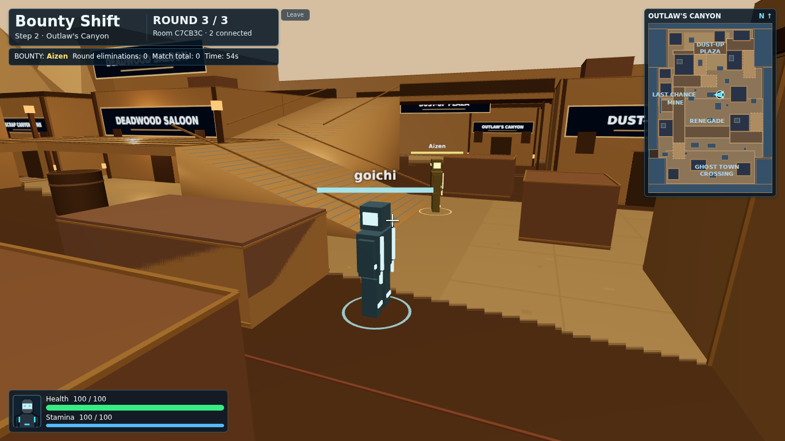
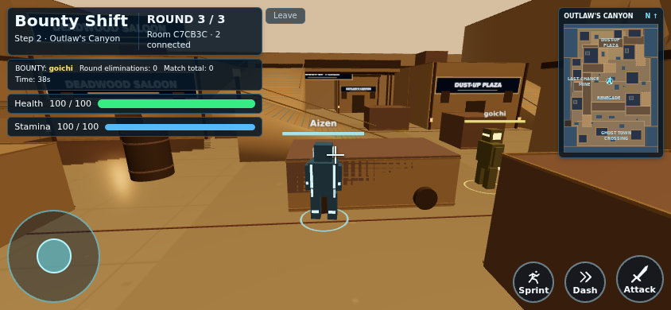
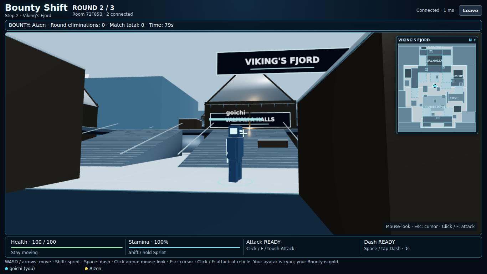
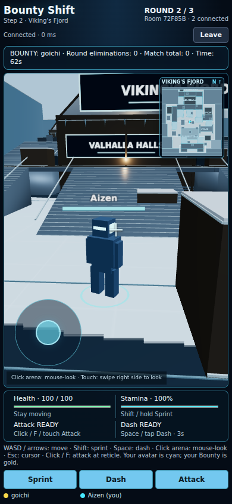

## Latest update: multiplayer entry flow

Login and waiting lobby now use the connected cinematic entry presentation. See [ENTRY_FLOW_IMPLEMENTATION.md](ENTRY_FLOW_IMPLEMENTATION.md) for real-state wiring, controls, preservation and validation. Start with `npm install`, `npm run build`, then `npm start`. This update leaves the existing full-screen match HUD and gameplay systems intact.

# Bounty Shift — full-screen mobile and desktop gameplay

The existing match now fills the viewport with a shared responsive HUD. Mobile places health/stamina below the top-left match information, joystick bottom-left and Sprint/Dash/Attack bottom-right. Desktop places portrait/health/stamina bottom-left and keeps bottom-right empty. Maps, multiplayer, balance and rotation are preserved.

See `HUD_IMPLEMENTATION.md` for the complete technical summary and validation scope.

Build and 108 existing tests pass. The two-client browser regression covers three complete matches, all maps and Aerie variants, real controls/combat, reconnects, full-screen sizing and responsive HUD containment across 11 desktop and seven mobile sizes. Mobile tests use Chromium touch emulation; physical-phone notch/gesture/FPS checks remain a device playtest.




## Preserved Step 2, Stage 3: Viking's Fjord

Map 5 extends the current map registry, renderer and shared traversal data. Maps 1–4, server-authoritative rotation, three-round matches, Aerie-only variants, combat, movement/camera, room flow and responsive UI are preserved. No Map 6, new mode or full-map polish pass is included.




## Five-map roster and authoritative rotation

| Map ID | Display name | Environment |
| --- | --- | --- |
| `central_plaza` | Central Plaza | Cyan/magenta city; guaranteed Round 1 |
| `scorched_point` | Scorched Point | Volcanic industrial/lava |
| `aerie_sky_port` | Aerie Sky-Port | Floating sky-port; server-selected Day/Night |
| `outlaws_canyon` | Outlaw's Canyon | Warm desert Wild West junk-punk town |
| `vikings_fjord` | Viking's Fjord | Cold overcast Nordic snow/ice fortress |

`shared/map.ts` adds one real map entry. The existing rotation helper is unchanged: Round 1 always selects Central Plaza; subsequent rounds choose from the registry excluding the immediate previous map when alternatives exist. The server's cryptographic random index chooses one map for the whole room. Five maps do not change the three-round match length.

The existing server chooses `nextMapId` and `nextMapVariant` during intermission. Fjord has no variants, so variant selection returns null without drawing randomness. Aerie alone retains Day/Night. At round start the server activates the new map, resets round health/resources and places players at its spawns before broadcasting. Identity, room, host and match totals persist. Reconnect snapshots contain the current map/variant; clients cannot choose either.

Existing scene replacement disposes map geometry, materials, textures, instances and renderer. Shared collision/spawns, minimap and camera solids all use the active definition. Fjord has no extra listener, timer, animation loop, cloud system, lava or desert lighting to leak between rounds.

## Viking's Fjord layout

The irregular 2200 × 2500 supported-ground union forms a narrow northern stronghold, wider village/frozen basin, eastern cove and southern coastal shelf. Ice cliffs and buildings define the boundaries; distant mountains and water are decorative.

| Region | Playable role |
| --- | --- |
| Fjord Fortress | Northern 180-height battlement circuit and western 90-height guard walk with multiple stair approaches |
| Valhalla Halls | Large snowy timber great hall, gabled roof, rune accents, broad front stairs/platform and paired side routes |
| Frost-Bitten Armory | Eastern longhouse, cover, raised terrace and separate west/south stair access |
| Raider's Cove | Rough eastern ice passage and lower longhouse; short, wide, open-ended cave flank |
| Runestone Plaza | Southern open snow/ice junction with standing runestone, fictional cyan glyphs and varied cover |
| Frost-Guard Docks | Snowy timber quay, two stair approaches, dock fingers and static longship silhouette |

Frozen ground crossings connect the regions around stone/ice cover. The Valhalla front stairs reach its entrance platform; side stairs reach the same level. A northern battlement loop rises from both sides of the hall and descends on the opposite side. The western fortress connects to the hall route and southern stairs. The Armory has independent west and south approaches. Raider's Cove reconnects after a short passage rather than becoming a cave maze. The dock loop can be climbed from either side and crossed before returning to the ground.

Steep longhouse roofs are visual architecture, not climbable terrain. Playable high ground is explicit battlements, terraces and bridge/deck surfaces. Longhouses remain closed solid landmarks with exterior fighting routes; no giant interior is added.

## Collision, traversal and ice

The existing shared server/client traversal code is unchanged. Ground support follows actual map footprints, blocks use vertical intervals, raised decks grant support and stairs use smooth ramp wedges. Tiny movement/dash substeps prevent tunneling. Unsupported ledges stop movement rather than causing a fall. Cliffs, hall bodies, cave walls/ceiling, cargo and railings have collision; trim, snow caps, roof beams and distant scenery avoid snagging players.

The main bands are 0 (basin/plaza/cave), 90 (2.7 rendered metres: village/fortress/Armory) and 180 (5.4 metres: northern battlements). Docks are at 80 (2.4 metres). All ramp slopes fit the unchanged 0.4 maximum. Primary stairs are 190–240 units wide. The cave's interior is 415 units wide with a 170-unit ceiling underside, allowing ordinary body/camera clearance. Camera obstruction uses existing ray checks against map solids, including gabled roof meshes.

Ice is ordinary terrain. Walking, sprint, stamina, dash, acceleration and friction are unchanged. No sliding, water gameplay, freezing damage, hazard, falling recovery, jumping or new traversal mechanic exists.

## Spawn configuration

Eight dedicated valid spawns are defined at (990,150), (1450,730,90), (270,1280), (1850,850), (1570,1310), (1800,1660), (480,1930), and (1230,2310). The third value is elevation; omitted elevations are ground level. All positions have valid support and are separated by more than 250 units. Current room capacity remains 2–6; eight points prepare for later scaling without altering the global spawn system.

Existing spawn-facing points toward the map plaza. Safe respawn/protection selects only Fjord positions. Buildings, route bends and ice cover separate the outer regions. Human spawn-balance evaluation remains a later playtest/polish task.

## Minimap and HUD

The existing north-up SVG minimap draws actual Fjord ground, blocks, decks and stairs using the same coordinates as collision/rendering. Cold blue-gray tones distinguish the map within the unchanged HUD frame. Labels identify Fortress, Valhalla, Armory, Cove, Runestone and Docks. The local cyan arrow follows X/Z and facing at every height. Opponents are not revealed.

HUD and intermission names resolve `Viking's Fjord` from registry metadata. No separate hard-coded gameplay header or duplicate minimap was added. Desktop/mobile sizing, no-scroll layout, joystick/look pointer IDs and combat buttons remain unchanged.

## Visual construction and performance

The new theme uses dark timber halls with steep snowy gables, heavy beams, stone foundations, battlements, sparse icicles, cold ice cliffs, snow caps, rune strokes, warm entrance accents, plank decks, distant mountains and a static coastal longship. The floor separates snowy ground from timber/stone geometry using subdued tones; distant ice/water creates fjord atmosphere.

Primitives/materials are reused. Static boxes, planks, trims and details are instanced by material. Resource tests check repeated swaps and idempotent disposal. Lighting uses the existing hemisphere/directional/two-point budget. There are no new downloaded textures/assets, dependencies, particle loops, physics scenery, real-time reflections or simulated water. Static haze replaces snowfall; final art and physical-phone performance tuning remain separate work.

## Files changed for Map 5

| Files | Change |
| --- | --- |
| `shared/maps/vikings-fjord.ts` (new) | Layout, collision blocks, ground, decks/ramps, spawns, regions, minimap metadata and cold environment |
| `shared/maps/types.ts`, `shared/map.ts` | Fjord theme and fifth registry entry |
| `src/environment.ts` | Fjord-only timber/snow roofs, battlements, ice, rune details, docks/boat and materials |
| `src/Minimap.tsx` | Fjord geometry colors within existing layout/marker system |
| `tests/viking.test.ts` (new), `tests/maps.test.ts`, `tests/environment.test.ts` | Traversal/combat/spawn/authority tests, expanded registry and scene-cleanup checks |
| `scripts/browser-smoke.mjs` | Two-client Fjord traversal, touch, combat, reconnect, minimap, layout and full-match coverage; frame-rate-independent stair QA |
| `README.md`, `VIKING_FJORD_PREVIEW.png`, `VIKING_FJORD_MOBILE_PREVIEW.png` | Instructions and actual browser previews |

All four completed map definitions, `shared/map-rotation.ts`, `server/rooms.ts`, `shared/game.ts`, `shared/combat.ts`, `shared/traversal.ts`, `src/camera.ts`, `src/Arena.tsx`, `src/main.tsx`, `src/scene.ts`, `src/style.css`, dependencies and hosting configuration remain unchanged from Map 4.

## Validation

Completed locally: production build passes and all 108 automated tests pass. Coverage includes all eight valid Fjord spawns, spread/slope limits, fortress/Valhalla and Armory routes, cave/plaza/dock loops, outer-spawn exits, ordinary ice speeds/stamina, dash on stairs/decks, blocked boundaries, same-level and through-floor melee, lethal Bounty credit, safe protected respawn, two/six-player transitions, reconnect and fresh-match resets.

Two independent Chromium/WebGL sessions passed the complete browser suite on all five maps and both Aerie variants. Three complete match sequences were checked: Central Plaza → Scorched Point → Aerie Day; Central Plaza → Aerie Night → Outlaw's Canyon; Central Plaza → Viking's Fjord → Outlaw's Canyon. Fjord checks include real desktop sprint up Valhalla and upper fortress stairs, cave traversal, dock stairs/dash, reticle melee and synchronized damage, minimap position at elevation, reload/reconnect, real multi-touch joystick + look + Sprint, touch Dash/Attack, final results, lobby reset and 11 viewport sizes without scrolling or clipped HUD. No page runtime errors were observed.

A separate full-duration run passed in 280.2 seconds with three real WebSocket clients: Central Plaza → Outlaw's Canyon → Aerie Sky-Port, with matching map/variant/timer state, reconnect, final results and a fresh Central Plaza opening. No map/position/timer fixtures were used in that run. Resource tests repeatedly replace every map and both Aerie variants, verifying disposal and no duplicate allocations surviving cleanup. Hash checks confirm the four completed map definitions, rotation/server, combat, traversal, controller/camera and responsive CSS are unchanged.

Fjord's environment contains 161 renderable mesh objects including 10 instanced batches; stair markings and icicles are batched. This is a structural resource count, not a physical-phone FPS benchmark.

Run locally:

```sh
npm ci --include=dev
npm run build
npm test
npm run dev
```

Browser and real-time integration checks:

```sh
BOUNTY_QA_BROWSER=/path/to/chromium npm run test:browser
node --import tsx scripts/map-rotation-soak.mjs
```

Browser QA uses private round/position fixtures to reliably cover every map and both Aerie variants; production selection remains untouched. The separate soak uses three real WebSocket clients and unmodified 90-second rounds/intermissions, without map, position or timer fixtures. Local/headless checks are not a public Render deployment or physical-phone FPS measurement.

## Public-device five-map acceptance checklist

1. Upload server and client together, refresh both devices and start a fresh room. Round 1 must be Central Plaza and the match must still have three rounds.
2. Complete matches until Fjord appears in a later round. Random selection may require several matches. Both devices must show the same map/round, Fjord HUD/minimap and no Aerie Day/Night subtitle.
3. Walk/sprint/dash across the frozen basin and Runestone Plaza. Ice must behave like ordinary ground. Visit every outer region and check solid cliffs/halls, visible cover and route choices.
4. Climb Valhalla's front/side stairs; cross the northern battlements and descend on the opposite side. Follow the western fortress walk and southern descent. Climb/descend both Armory approaches.
5. Traverse Raider's Cove cave from both ends. Climb the docks from both sides, cross the quay and visit its fingers. Check no floor gaps, snagging, escape routes outside the arena or inaccessible intended platforms.
6. Rotate the camera while idle/moving near halls, cave, battlements, stairs and docks. Check obstruction handling and remote avatar facing/height.
7. Check north/upper Fortress and Valhalla, northeast Armory, east Cove, south Runestone and lower Docks against the north-up minimap marker.
8. Fight: compare synchronized health/damage, KO, Bounty credit, scores and safe protected respawns. Refresh while elevated, damaged/scored or KO; current map/identity/state must recover.
9. Mobile: joystick + right swipe + Sprint simultaneously, then Dash/Attack. Navigate stairs, cave and bridges. Rotate phone and check HUD/minimap/button visibility without scrolling. Evaluate actual device frame rate.
10. Finish Round 3, compare results, return to lobby and start fresh. Round 1 must again be Central Plaza. In later matches load Maps 1–4, including both Aerie variants, and verify no Fjord ice/buildings or stale collision remain.

## Remaining prototype limits

This is procedural map-first art, not final models/textures. Hall bodies are closed and steep roofs are not traversable; exterior platforms and fortress routes provide the gameplay. Static cold haze replaces snowfall. Human spawn fairness, camera comfort at tight angles and physical-phone frame rate still need device playtests. WebGL/hardware acceleration is required. The existing single-instance in-memory server/restart limits and reconnect grace remain.

The five-map roster is implemented. This task stops here; the dedicated polish phase and new modes require separate instructions.

## Preserved controls

| Action | Desktop | Touch |
| --- | --- | --- |
| Move | WASD / arrows, relative to camera yaw | Lower-left analog joystick, relative to camera |
| Look | Click arena, then mouse-look; Esc releases | Swipe the right half of the arena |
| Sprint | Hold Shift while moving | Hold Sprint while using joystick |
| Dash | Space | Tap Dash |
| Melee | Click while mouse-look is active, or F | Tap Attack |
| Camera fallback | Q/E yaw; cursor-look if pointer lock unavailable | Independent look pointer |

Camera orbit works while stationary. Movement is flattened to horizontal camera yaw, with normalized diagonals. Moving avatars rotate toward their gameplay direction; stationary camera look does not spin the body. Dash uses current movement input, or the avatar's last gameplay facing when idle. Melee uses camera yaw/reticle direction. Name/health sprites still billboard; local cyan, private Bounty gold and other player colors are preserved.

The existing joystick/look pointer-ID separation, touch buttons, focus/cancel clearing, HUD buttons and gameplay-only prevention of page scrolling remain intact. UI clicks do not activate pointer lock. Match screens use one full-viewport `100vh`/`100dvh` canvas with overlay HUD. The existing scene resizes the drawing buffer and camera projection. Menus and lobby retain normal scrolling where needed.

## Game rules and match foundation

1. Create a room and share its six-character code. Join with 2–6 players, ready up, and have the host start.
2. Each player receives one private Bounty target; nobody targets themselves. Fight any player, but only knocking out your assigned target earns one Bounty elimination. Successful credit reassigns your target; with two players the same opponent remains necessary.
3. Health is 100. Melee deals 25 damage, has an 80-unit range/120-degree arc and a 0.6-second cooldown. One strike hits the nearest eligible player; obstacles and height can prevent hits.
4. KO lasts five seconds. Respawn restores health/resources and grants 1.5 seconds of protection; the protected player's accepted attack ends it. Initial round spawns have no protection.
5. Each of three rounds lasts 90 seconds. Round expiry freezes gameplay and snapshots the leaderboard. A five-second intermission starts the next round automatically, resetting round state while retaining match totals.
6. After Round 3, final totals determine the winner; top ties share victory. Only the host returns everyone to lobby. A fresh match clears all prior scores/history/targets and readiness.

Walking remains 220 units/second; sprint remains 330. Stamina max 100, drain 28/second, regeneration 22/second after 0.6 seconds. Dash remains 850 units/second for 0.18 seconds with a three-second cooldown. Centralized constants remain in `shared/game.ts`, `shared/combat.ts`, `shared/rounds.ts`, `shared/presentation.ts` and `shared/traversal.ts`; existing balance values were not changed.

Server authority still covers movement, health, hit/KO attribution, targets, score, timers, transitions and results. Only the recipient's own target is sent in their objective HUD; public player snapshots never contain other target assignments. Camera position/rotation stays local. Reconnect grace remains ten seconds; identity, health, elevation, target, scores, cooldowns and deadlines are preserved while the room/server exists. Duplicate tabs cannot steal an active identity. Permanent departures repair targets, migrate host authority and cancel play gracefully if too few players remain. See `FOUNDATION_AUDIT.md` for the Step 1 audit history.

## Upload into the same GitHub repository

1. Download and extract `Bounty_Shift_Fullscreen_Responsive_HUD.zip`.
2. Open the extracted `bounty-shift` folder; it contains `src`, `shared`, `server`, `tests`, `scripts`, `package.json` and `README.md`.
3. Open https://github.com/edmund0b/bounty-shift on the branch Render already deploys. Choose Add file → Upload files.
4. Drag the CONTENTS of the extracted folder into the upload area. Do not upload the outer folder or ZIP itself. Preserve nested paths; the repository root must directly contain `package.json`.
5. Confirm all existing map files remain and the updated `src/main.tsx`, `src/Arena.tsx`, `src/style.css`, new `src/GameHud.tsx`, `index.html` and documentation are included. Do not delete existing files.
6. Commit: `Make gameplay full-screen with responsive mobile and desktop HUD`.
7. Wait for the existing Render automatic deploy. If disabled, use the same service's Manual Deploy → Deploy latest commit. Keep build `npm ci --include=dev && npm run build`, start `npm start` and all existing settings. No new service/account is needed.
8. After Render reports Live for the new commit, refresh all clients at https://bounty-shift.onrender.com and start a fresh room. Deploy restarts clear in-memory rooms. Test both HUD layouts, touch/desktop controls, real health/stamina, resizing and normal round/map progression. See `HUD_IMPLEMENTATION.md`.
