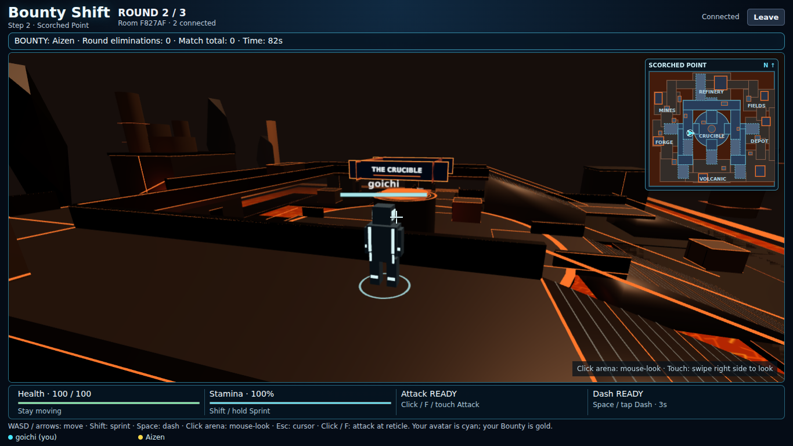
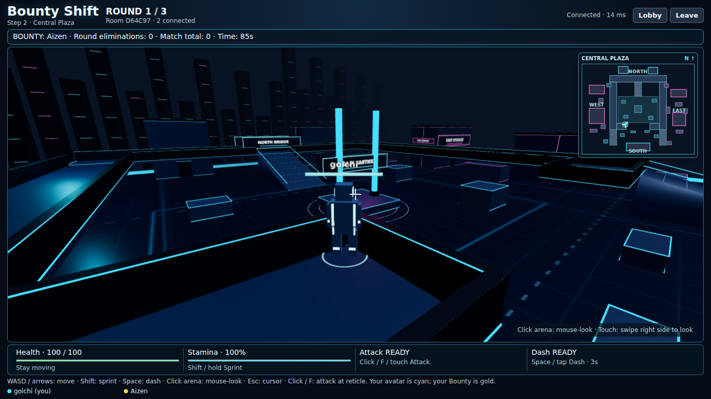

# Bounty Shift — Step 2, Stage 3: Scorched Point + Map Rotation

This is an additive Map 2 update to the completed Central Plaza build. Central Plaza's map-definition file, geometry, spawns, controller tuning, player colors and responsive CSS are preserved. The existing one-service Render/WebSocket architecture and Bounty match rules remain.



## Authoritative map rotation

`MAPS` contains exactly two playable entries: `central_plaza` and `scorched_point`. Maps 3–5 are not implemented or registered.

- Every fresh match starts Round 1 on Central Plaza.
- `selectRoundMap` in `shared/map-rotation.ts` obtains its eligible pool from registered maps, excludes the previous map when alternatives exist, and accepts a server-supplied random-index function. The server supplies cryptographic `randomInt`; no client chooses maps.
- With two maps, the current sequence is Central Plaza → Scorched Point → Central Plaza. Registering more completed maps automatically expands the later-round pool without changing this helper or introducing a shuffle bag. The helper is independent of mode/scoring and does not hard-code three rounds.
- At round expiry, the server freezes the old round/results and chooses `nextMapId` exactly once. During intermission, `mapId` still describes the frozen previous round; the existing transition panel announces the next map.
- At the next round's start, the server atomically activates the chosen `mapId`, resets players using that map's own spawns, assigns fresh targets and broadcasts the resulting state. The client clears old prediction input, creates the matching environment and updates its minimap. There is no active mid-round map switch.
- `mapId`, `nextMapId` and `match.mapHistory` are synchronized server state. Refresh/reconnect obtains the current map directly from the welcome packet. Client-supplied map IDs are ignored. Lobby return clears pending/history state and restores the Central Plaza opening.

The existing arena lifecycle unmounts the scene during intermission and disposes geometry, materials, textures, instances and the renderer; listeners/render loops are cleaned up too. The new scene uses only its own map definition for camera obstacles, movement, melee, spawns and minimap data. No cross-map global collision cache is used.

## Scorched Point regions and traversal

Scorched Point is 2400 × 2200 units, approximately the same footprint as Central Plaza but with different geometry, lava-separated sectors and three actual height bands:

| Region | Playable identity |
| --- | --- |
| The Crucible | Raised circular fighting platform at elevation 90; a solid furnace core, molten vent rings and four wide approaches |
| Magma Refinery | Northern machinery/furnace sector, tanks/chimneys and access to both the Crucible and upper overlook |
| Obsidian Mines | Dark rock/support silhouettes and tighter lower routes |
| Lava Fields | More open eastern platform lanes surrounded by visible molten ground |
| Hell's Forge | Western furnace sector and ramp/bridge toward the center |
| Hell's Depot | Eastern storage/logistics sector, cargo, main bridge and outer lane |
| Volcanic Depot | Southern machinery/spawn approach with alternate maintenance connections |

Lower ground is elevation 0, main bridges/Crucible/maintenance landings are 90 (2.7 rendered metres), and the refinery overlook/catwalk circuit is 190 (5.7 metres). Four primary center approaches and five low/mid/upper access ramps connect the network. Stair stripes sit on smooth authoritative slopes. West ascent → refinery overlook → east descent is traversable; a separate north ramp reaches high ground. Lower routes connect sectors without forcing every chase across the Crucible.

Optional map definition fields extend the existing model: elliptical footprints, an explicit ground union, map-specific minimap labels, reusable decoration modules, palette/theme and lighting configuration. The same environment builder, support-height integrator, camera and minimap render both maps. Elliptical movement/solid checks match the circular center; melee includes the existing height/range rules and circular core/deck obstruction checks.

### Lava boundaries

Lava is a lightweight generated emissive-looking floor below the actual platforms. It does not grant walkable support. Server and prediction both require valid map ground or a reachable deck/ramp. At unsupported edges, walking/sprint/dash stop safely; upper rails make major boundaries readable. No damage-over-time, falling, jump or client-only KO mechanic was added. Players cannot naturally fall into lava in the current supported-surface controller, so no new recovery rule is needed and they cannot become trapped below the map.

### Own spawns and minimap

Eight safe ground spawn positions are spread around Refinery (1190,390), Mines (380,570), Lava Fields (2050,600), Forge (180,980), Hell's Depot (2210,1200), Volcanic Depot (1240,1900), west maintenance (350,1880) and east logistics (1900,1710). Capacity remains 2–6; the extra positions prepare future expansion. Round start and protected respawn use only the active map's positions and existing reset/clearance rules.

The preserved top-right, fixed-north minimap draws Scorched Point's actual ground regions, circular Crucible, bridges, ramps, cover and sector labels. The cyan local arrow uses the same world coordinates at every elevation. It shows no opponents. Size/input transparency/no-scroll behavior is preserved.

### Performance and visual identity

The same procedural pipeline builds dark iron architecture, orange/ember trim, facade signs, tanks, pipes, vents, crates, cliffs, chimneys and distant lavafalls. Generated small lava texture and cached floor/sign textures avoid external asset downloads. Static box decorations are instanced; primitives/materials are reused. The lower rectangle union is tessellated once into one ground mesh, avoiding overlapping-floor flicker and per-tile draw calls. Only the existing small lighting budget is used with map-specific warm colors; no particles, additional dynamic lights, heavy shadows, mirrored reflections or physics props were added. Universal cyan/gold player and HUD readability remains unchanged.

## Map 2 validation

- Production build passes; the existing Three.js advisory chunk-size warning remains.
- All 80 automated tests pass. New tests cover rotation/future registered pools, three-band routes, all center approaches, ground/lava support, dash/edge boundaries, valid spread spawns, circular/vertical melee, Scorched Point Bounty KO/respawn and simultaneous trades, privacy, atomic map changes, score/reset integrity, elevated reconnect, host migration and fresh matches.
- Resource tests construct alternating maps repeatedly, verify map-specific signage/collision counts and require every geometry/material/texture/instance to dispose exactly once. Central Plaza's definition remains byte-for-byte unchanged.
- Two independent Chromium/WebGL sessions pass the existing controller/combat flow plus authoritative map/minimap switching, real client-controlled refinery ascent, dash, melee and synchronized damage, Scorched Point refresh on an upper route, multi-touch joystick/look/Sprint, touch Dash/Attack, three rounds, final results and the current host's lobby return. No page runtime errors were observed. Eleven viewport sizes pass containment on both maps.
- A separate full-duration integration run uses three real WebSocket clients with unmodified 90-second timers: Central Plaza → Scorched Point → Central Plaza, reconnect/host migration, identical deadlines/map history/results and a fresh second opening. It passed in 280.2 seconds. It does not replace public-network or physical-phone acceptance.

Reproduce the full-duration check after building with:

```sh
node --import tsx scripts/map-rotation-soak.mjs
```

It takes about 4 minutes 40 seconds and uses no accelerated timer/position fixtures. Normal `npm test` remains fast. Browser smoke fixtures accelerate transitions separately and are not production endpoints.

## Exact Map 2 changed files

| Files | Change |
| --- | --- |
| `shared/maps/scorched-point.ts` (new) | Scorched Point geometry, ground/lava support, sectors, routes, cover, spawns, labels, decorations and warm lighting |
| `shared/map-rotation.ts` (new), `shared/map.ts` | Generic opening/non-repeat selection and two-map registry |
| `shared/maps/types.ts` | Optional circular footprints, ground regions, minimap labels and environment modules |
| `shared/traversal.ts`, `shared/combat.ts` | Map-specific ground/ellipse support and circular solid hit obstruction |
| `shared/game.ts`, `shared/rounds.ts`, `server/rooms.ts` | Synchronized pending map/history and atomic round activation/reset |
| `src/environment.ts`, `src/scene.ts` | Shared warm industrial rendering, ground union/lava and map lighting; existing city rendering retained |
| `src/Minimap.tsx`, `src/Arena.tsx`, `src/main.tsx` | Map-specific minimap shapes/labels, map canvas identity, dynamic header/transition name |
| `tests/maps.test.ts`, `tests/environment.test.ts` (new) | Rotation/traversal/combat/server/lifecycle regressions |
| `tests/multiplayer.test.ts`, `tests/traversal.test.ts`, `tests/match.test.ts` | Existing tests now resolve the actual active map while retaining Central Plaza checks |
| `scripts/browser-smoke.mjs`, `scripts/map-rotation-soak.mjs` (new) | Two-browser controls/map transitions and full-duration three-client match |
| `README.md`, `SCORCHED_POINT_PREVIEW.png`, `SCORCHED_POINT_MOBILE_PREVIEW.png` (new previews) | Documentation and browser-captured screenshots |

`shared/maps/central-plaza.ts`, `src/camera.ts`, `src/style.css`, controller constants, dependencies/lockfile and hosting configuration are unchanged from the Map 1 delivery.

## Public Scorched Point acceptance

1. Deploy server/client together using the instructions below. Refresh both devices and create a new room. Ready/start: Round 1 must always be Central Plaza, including a fresh second match.
2. Play to Round 1 expiry. Both screens must show the same next-map name and countdown. Round 2 must load Scorched Point's own positions, world and minimap, with no Central Plaza objects or invisible collision.
3. Navigate the Refinery ramp to The Crucible. Cross west/east/south bridges; use a lower side route. Reach upper catwalks, cross the overlook and descend on another side. Walk/sprint/dash on each height band and confirm safe edges/lava boundaries.
4. Check stationary mouse-look/pointer lock/Esc and near-wall/under-catwalk camera obstruction. Compare remote positions/facing/height. Test melee, health, target credit, KO, safe protected respawn and score retention on both devices.
5. Refresh on Scorched Point while elevated, damaged, scored or KO. Restore the same identity/map/state without duplicate players. Test host transfer and the new host's controls.
6. Finish Round 2. Both clients must switch to a valid registered map (currently Central Plaza) for Round 3. No lava/warm lights/old geometry/minimap or Scorched Point collision may remain. Finish the match, compare totals/winner/tie, return to lobby and start fresh.
7. On physical mobile, use joystick plus right-side swipe plus Sprint simultaneously, then Dash/Attack. Traverse slopes/bridges and rotate the phone. HUD/minimap/buttons must remain reachable with no page scrolling.
8. Repeat with three or more players when practical. Observe frame rate during repeat matches, tight machinery corners and camera compression. Report map/sector, device/browser, input and both screens' state for any issue.

Remaining polish: stylized procedural props/architecture, static lava/haze rather than final effects, near-wall camera framing and actual-device touch ergonomics/performance. No damage lava, new mode, balance change, final art pass or Maps 3–5 were added. Stop here for owner testing.

## Preserved Map 1 foundation reference

Central Plaza is the first playable map in the existing Bounty Shift project. It extends the Step 1 multiplayer/match foundation and Step 2 third-person renderer/controller. Central Plaza remains the opening map. Scorched Point is the second registered map; no other maps are registered.

Repository: https://github.com/edmund0b/bounty-shift

Existing public service: https://bounty-shift.onrender.com



## The map

The playable district is 2600 × 2100 world units, approximately 1.9 times the previous arena's ground area. Five connected regions have different layouts:

- Central Plaza: an open middle with a solid monument base, twin cyan energy pylons, surrounding cover and routes on every side.
- West Depot: industrial buildings, cargo cover, magenta signage, ground lanes and a west loading balcony/catwalk.
- East Storage: asymmetric storage blocks and tighter cargo corners, pink facade lighting, ground connections and an east upper route.
- South Terminal: cyan landmark signage, an open spawn approach, side lanes and nearby cover.
- North Bridge: a raised cross-map route connecting both side catwalks, with a central stair approach and skyline beyond.

The upper network has three wide approaches: west stairs, east ramp and north stairs. Players can ascend on one side, cross the North Bridge and descend elsewhere. Side balconies overlook the plaza without sealing its central approach. Decks permit ground-level passage underneath where there is sufficient clearance; ramps are solid wedges. Building facades and door-shaped lighting panels are closed solids, not entrances. Open lanes around the buildings are real routes.

The rendering is procedural and stylized: dark navy architecture, cyan/magenta trim, generated facade signs, cargo, barriers, sparse planter trees, lane markings and lightweight distant towers. Floor sheen uses materials/painted lighting rather than costly real-time reflections.

## Map architecture and authoritative traversal

- `shared/maps/types.ts` defines bounds, blocks with bottom/top heights, walkable surfaces/ramps, spawns, districts and environment settings.
- `shared/maps/central-plaza.ts` is the single source of map geometry, collision volumes, upper routes and spawn points.
- `shared/map.ts` registers `central_plaza`. `scorched_point` is also registered; no fake future entries are selectable. Rooms carry a map ID; the server, client prediction, renderer and minimap resolve the same definition. The server-only rotation helper now selects post-opening maps.
- `shared/traversal.ts` supplies common support-height and volume checks. World X/Y remain horizontal coordinates, rendered as X/Z at `VIEW.scale` (0.03). `elevation` is authoritative feet height in world units. Upper decks are at 100 units, or 3 rendered metres.
- Walking, sprint and dash use the existing shared movement integrator with small collision substeps. Slopes change height continuously; visually marked stairs use smooth collision ramps. Players cannot step directly from the ground onto a bridge, dash through a solid, or walk off an unsupported upper edge. Rails guard edges while leaving ramp mouths and route joins open.
- Prediction uses the same map/traversal functions as the server. Clients continue sending input intent, never their position or elevation. Snapshots/reconnect restore authoritative elevation. Remote interpolation samples the matching support to keep feet on slopes.
- Melee preserves damage, range, arc and cooldown. Hit checks now include vertical distance and a chest-height line through solid volumes/ramp wedges. Ground players cannot hit through an overhead deck at players above them. Low cover below the strike line can be struck over.
- The camera retains Stage 2 free look/obstruction rays, now following the player's elevation and staying above their current floor. Close obstruction slightly increases avatar fading to preserve visibility. Round spawn facing points toward the plaza. No controller replacement, jump, falling/gravity or new ability was introduced.

Eight valid ground spawn positions are spread across outer districts and approaches. Current room capacity remains 2–6. Round starts use these spread positions; respawn retains the existing greatest-clearance choice among valid spawns and existing protection. Round/lobby resets restore ground elevation and all existing reset rules.

## Navigation minimap

The top-right, north-up SVG minimap is generated directly from the active map's bounds, buildings, cover, walkways, ramps and district locations. The cyan arrow shows only your authoritative position and facing. Upper-floor movement uses the same horizontal X/Y coordinates. No enemy markers, target radar or reveal mechanics were added.

The marker updates in the existing arena render loop. The panel is pointer-transparent and responsively clamped, so it does not capture camera input, displace the arena or add page height. Desktop and narrow/short mobile sizes preserve the existing one-viewport layout.

## Preserved controls

| Action | Desktop | Touch |
| --- | --- | --- |
| Move | WASD / arrows, relative to camera yaw | Lower-left analog joystick, relative to camera |
| Look | Click arena, then mouse-look; Esc releases | Swipe the right half of the arena |
| Sprint | Hold Shift while moving | Hold Sprint while using joystick |
| Dash | Space | Tap Dash |
| Melee | Click while mouse-look is active, or F | Tap Attack |
| Camera fallback | Q/E yaw; cursor-look if pointer lock unavailable | Independent look pointer |

Camera orbit works while stationary. Movement is flattened to horizontal camera yaw, with normalized diagonals. Moving avatars rotate toward their gameplay direction; stationary camera look does not spin the body. Dash uses current movement input, or the avatar's last gameplay facing when idle. Melee uses camera yaw/reticle direction. Name/health sprites still billboard; local cyan, private Bounty gold and other player colors are preserved.

The existing joystick/look pointer-ID separation, touch buttons, focus/cancel clearing, HUD buttons and gameplay-only prevention of page scrolling remain intact. UI clicks do not activate pointer lock. Match screens use the preserved `100vh`/`100dvh` compact-header/flexible-arena/compact-HUD structure; menus and lobby retain normal scrolling where needed.

## Game rules and match foundation

1. Create a room and share its six-character code. Join with 2–6 players, ready up, and have the host start.
2. Each player receives one private Bounty target; nobody targets themselves. Fight any player, but only knocking out your assigned target earns one Bounty elimination. Successful credit reassigns your target; with two players the same opponent remains necessary.
3. Health is 100. Melee deals 25 damage, has an 80-unit range/120-degree arc and a 0.6-second cooldown. One strike hits the nearest eligible player; obstacles and height can prevent hits.
4. KO lasts five seconds. Respawn restores health/resources and grants 1.5 seconds of protection; the protected player's accepted attack ends it. Initial round spawns have no protection.
5. Each of three rounds lasts 90 seconds. Round expiry freezes gameplay and snapshots the leaderboard. A five-second intermission starts the next round automatically, resetting round state while retaining match totals.
6. After Round 3, final totals determine the winner; top ties share victory. Only the host returns everyone to lobby. A fresh match clears all prior scores/history/targets and readiness.

Walking remains 220 units/second; sprint remains 330. Stamina max 100, drain 28/second, regeneration 22/second after 0.6 seconds. Dash remains 850 units/second for 0.18 seconds with a three-second cooldown. Centralized constants remain in `shared/game.ts`, `shared/combat.ts`, `shared/rounds.ts`, `shared/presentation.ts` and `shared/traversal.ts`; existing balance values were not changed.

Server authority still covers movement, health, hit/KO attribution, targets, score, timers, transitions and results. Only the recipient's own target is sent in their objective HUD; public player snapshots never contain other target assignments. Camera position/rotation stays local. Reconnect grace remains ten seconds; identity, health, elevation, target, scores, cooldowns and deadlines are preserved while the room/server exists. Duplicate tabs cannot steal an active identity. Permanent departures repair targets, migrate host authority and cancel play gracefully if too few players remain. See `FOUNDATION_AUDIT.md` for the Step 1 audit history.

## Build and automated validation

Use Node.js 22 or newer inside the repository:

```sh
npm ci --include=dev
npm run build
npm test
npm start
```

Open http://localhost:3000 in two independent browser sessions. The one Node service serves both frontend assets and `/ws`; `PORT` can override 3000. For development, use `npm run dev`. Build before integration/browser tests so production frontend assets exist.

Optional Chromium browser checks:

```sh
npx playwright-core install chromium
npm run test:browser
```

On a Unix shell, an existing compatible binary can be selected with `BOUNTY_QA_BROWSER=/absolute/path/to/chromium npm run test:browser`. `BOUNTY_QA_OUTPUT` selects a screenshot directory. The script arranges local server fixtures and advances test time; it adds no production debug endpoint and is not part of normal startup.

Local validation for this delivery:

- Production TypeScript/frontend/server build passes. Vite retains the advisory Three.js chunk-size warning.
- All 80 automated tests pass, including real independent WebSocket sessions. Added coverage checks map/spawn validity, all approaches, sprint/dash on slopes, a complete west-to-north-to-east upper route and descent, deck underpasses, upper edge constraints, vertical melee, authoritative/predicted elevation agreement, forged-height rejection, elevated reconnect, KO respawn and round reset. Previous room, combat, privacy, scoring, host, reconnect and full-match tests remain.
- Chromium/WebGL checks pass with two independent sessions: stationary pointer-lock yaw/pitch, camera steering, sprint/dash, reticle melee and synchronized health, refresh, actual client-controlled stair ascent, map marker coordinates, real multi-touch joystick/look, three-round transitions, final results and lobby reset. No page runtime errors were observed.
- Eleven viewport sizes pass containment/HUD visibility checks: 1920×1080, 1440×900, 1366×768, 1280×720, 1024×600, 800×450, 640×360, 390×844, 375×667, 320×568 and 844×390.

Browser timers are accelerated for transition checks. Physical phones, public network latency, full-duration matches and performance on actual devices remain owner acceptance checks after deployment.

## Map 1 implementation files (reference; current Map 2 changes listed above)

Relative to the completed Stage 2 controller:

| Files | Change |
| --- | --- |
| `shared/maps/types.ts`, `shared/maps/central-plaza.ts` (new) | Reusable map model and Central Plaza definition |
| `shared/map.ts` | Registry, active map and compatibility exports |
| `shared/traversal.ts` (new) | Shared support heights, ramp/volume collision and render support sampling |
| `shared/game.ts` | Elevation/map-aware authoritative and predicted movement; snapshot map ID |
| `shared/combat.ts` | Map-aware safe spawns and height/volume-aware hit checks |
| `shared/presentation.ts` | Close-obstruction avatar fade threshold |
| `server/rooms.ts` | Room map identity, map-aware movement/combat/spawns and elevation snapshots |
| `src/environment.ts` (new) | Procedural map geometry, landmarks, signs, skyline and batching |
| `src/Minimap.tsx` (new) | Actual-layout, local-player-only navigation minimap |
| `src/scene.ts`, `src/camera.ts` | Map rendering, elevation-aware avatars/camera and support interpolation |
| `src/Arena.tsx` | Active-map scene/minimap integration and defensive pointer-lock release handling |
| `src/main.tsx` | Active-map prediction, spawn-facing camera initialization and map heading |
| `src/style.css` | Responsive minimap rules only; no-scroll gameplay layout preserved |
| `tests/traversal.test.ts` (new) | Map/height/traversal/network regression tests |
| `tests/camera.test.ts`, `tests/combat.test.ts`, `tests/movement.test.ts`, `tests/multiplayer.test.ts`, `tests/presentation.test.ts` | New-map geometry regressions and elevated network/camera checks |
| `scripts/browser-smoke.mjs` | Minimap, elevated client traversal and Central Plaza preview checks |
| `README.md`, `STEP2_PREVIEW.png`, `STEP2_MOBILE_PREVIEW.png` | Current documentation and browser-captured previews |

No dependency, lockfile, Render configuration, match-rule, room-capacity or scoring changes. The ZIP includes unchanged repository files too.

## Upload to the existing GitHub repository and redeploy

1. Download and extract `Bounty_Shift_Step_2_Stage_3_Scorched_Point.zip`. Open its `bounty-shift` folder.
2. Open https://github.com/edmund0b/bounty-shift on the branch connected to Render. Choose Add file → Upload files.
3. Drag the folders `src`, `shared`, `server`, `tests`, `scripts`, plus `README.md`, `SCORCHED_POINT_PREVIEW.png`, `SCORCHED_POINT_MOBILE_PREVIEW.png`. Upload their contents with the paths intact. Do not drag the enclosing `bounty-shift` folder or the ZIP. Do not upload `node_modules`, `dist` or `.git`.
4. Before committing, confirm these new paths: `shared/maps/scorched-point.ts`, `shared/map-rotation.ts`, `tests/maps.test.ts`, `tests/environment.test.ts`, `scripts/map-rotation-soak.mjs`. Also confirm the updated `server/rooms.ts`; both server and client must receive this update together.
5. Commit message: `Add Scorched Point and authoritative map rotation`.
6. Wait for the existing Render auto-deploy. If disabled, open the existing service and choose Manual Deploy → Deploy latest commit. Keep build `npm ci --include=dev && npm run build`, start `npm start`, and existing environment/root-directory settings. No new service or account is needed.
7. Wait for Live and verify the new commit. Refresh all devices at https://bounty-shift.onrender.com. Redeploy resets in-memory rooms, so create a fresh room. Round 1 should say `Step 2 · Central Plaza`; Round 2 should say `Step 2 · Scorched Point`, with the matching minimap. Do not leave an older client tab running against the updated map/height protocol.

## Public-device acceptance checklist

Start with two separate devices, ideally on different networks; repeat with at least three players when practical.

- Create/join, ready up and start with existing host controls. Check separate safe spawns, correct private targets, initial health/resources and the minimap.
- From South Terminal, reach Central Plaza, West Depot and East Storage using main and side routes. Use cover to break sightlines. Confirm solid buildings block movement and open lanes remain open.
- Ascend west stairs, cross the North Bridge to the east catwalk and descend the east ramp. Try the central north stairs in both directions. Sprint/dash on slopes and decks: no height jumps, sinking, falling through floors, edge escape or wall clipping. Walk underneath a deck on the ground where clearance permits.
- Orbit/tilt while stationary and while climbing. Test near-wall camera compression/recovery. Confirm remote players' positions/facing/height agree on both devices.
- Check your cyan minimap arrow follows actual horizontal position and facing on ground and high ground; opponents never appear on it.
- Test camera-facing melee on ground, on a slope and on the upper route. Out-of-range, wall/deck-blocked and wrong-elevation hits must fail. Both devices must agree on damage, KO and Bounty credit. A non-target KO still earns zero objective credit.
- KO and respawn: valid ground spawn, full health, protection, existing cooldown/reset behavior, target and score retention. Refresh while elevated/damaged/KO and reconnect within grace; there must be no duplicate body or reset score.
- Finish the full three-round match. Confirm synchronized expiry/intermission, fresh spawns/health/round scores, persistent match totals, refreshed private targets, final winner/tie and host lobby return. Start a fresh second match and verify old state is cleared.
- Test host disconnect/migration and a permanent target departure with three players. With fewer than two remaining, play must end cleanly.
- On a physical phone, stand still and swipe to look; simultaneously use the left joystick and right look region. Test touch Sprint/Dash/Attack, all ramps and turns, release/cancel/app switch and portrait/landscape. The minimap must not obstruct controls.
- Resize desktop and rotate mobile: header, target/timer, arena, bottom HUD and buttons remain visible together with no page scrolling or zoom adjustment.

## Performance and remaining limits

Static decorative boxes/trim/skyline are instanced by cached material. Main collision meshes remain individually available to camera ray checks. Unit geometries, signs and materials are reused; floor/sign textures are generated locally. No large asset downloads, additional dependencies, heavy reflection/bloom/shadow systems or extra real-time lights were added. Resources are disposed when leaving/changing the arena, and the minimap shares the existing animation loop.

This is a procedural playable interpretation of the concept, not final environment/character art. Vertical traversal is supported surfaces/ramps rather than general jumping/falling physics. Camera compression in tight spaces and real-phone frame rate still need public playtesting. WebGL/hardware acceleration is required. Existing single-instance in-memory hosting/restart limits, ten-second reconnect window and melee without latency rewind remain unchanged. Only Central Plaza and Scorched Point are playable. Further maps, radar and additional modes are not implemented.

The next step is owner testing and fixing Map 1 issues. Map 3 work waits for a separate instruction. Challenge deadline: October 31, 2026 at 11:59 PM Pacific; final submission needs the project title, public link and preview image.
