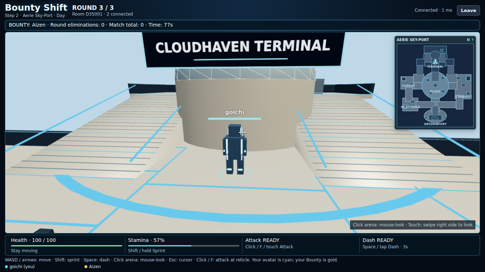
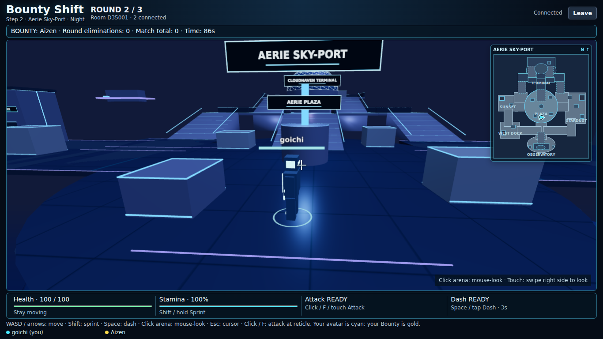

# Bounty Shift — Step 2, Stage 3: Aerie Sky-Port


## Map 3 implementation

Aerie Sky-Port extends the existing map definition, renderer, traversal, spawns, minimap and round lifecycle. Both prior map definitions, third-person camera/controller, responsive CSS, movement/combat logic and dependency versions remain unchanged.




### Layout and vertical traversal

Aerie uses a 2200 × 2400 suspended footprint with unsupported open-sky gaps. Aerie Plaza is the central circular hub and blue navigation beacon. West Sunset Gate and compact west Stardust loading pocket contrast with the longer eastern Stardust Dock. The north Cloudhaven Terminal has a dome, elevated bridges, two side stair approaches and paired stairs to its observation level. South High Observatory has a smaller dome, terrace and accessible ramp. Lower side connectors join both docks to the observatory approach as alternatives to the central route.

Main platforms are elevation 0; the terminal/bridges and observatory terrace are 90; the upper terminal overlook is 180. Stair visuals use the existing smooth shared ramp collision. No jumping or falling system was added. Unsupported edges stop movement and dash; railings protect selected high edges. Eight map-owned spawns are validated across west/east docks, both terminal landings and the observatory outer deck. Respawn uses the existing safe-spawn/protection system.

### Authoritative Day / Night

The server chooses `nextMapVariant` once alongside `nextMapId` during intermission. `selectMapVariant` receives server cryptographic randomness and uses the registered map's variant keys. Aerie supports `day` and `night`; other maps use null. At round start, `mapId` and `mapVariant` activate atomically before spawning and broadcasting. Resume packets carry the same active variant; forged client map/variant fields cannot change it. Lobby return clears both pending values. There is no real-time sun cycle or client randomization.

`mapEnvironment` resolves only environment colors and lighting. Day/Night share all physical map data. The existing scene effect also keys on variant, disposes its prior resources and uses the same environment builder. The HUD adds Day/Night beside the existing map name. Map changes still happen only between rounds.

### Minimap and performance

The north-up minimap draws Aerie's actual ground footprints, elevated surfaces, ramps, buildings and labels from its definition. The cyan local-player arrow uses the existing X/Z/facing updates; enemies are not revealed. Sky-specific map colors replace lava colors without changing sizing or placement.

Static low-poly cloud banks are instanced below the arena, with a distant cloud-colored horizon surface. Domes use low-poly hemispheres and metallic wire ribs; simple shuttles are decorative. Common primitives/materials and trim batching are reused. The existing light budget is retained; there are no volumetric clouds, real-time reflections, new animation loops or texture downloads. Previous scene resources are disposed by the existing lifecycle.

### Map 3 verification and public testing

Validation completed: production build passes; all 88 automated tests pass. Two independent Chromium/WebGL sessions pass both shared variants, Aerie keyboard stair ascent, multi-touch joystick/look/Sprint, touch Dash/Attack, refresh, three-round scene switching, results/lobby reset and 11 viewport sizes. No page runtime errors occurred. A separate three-client, unmodified-timer match passed in 280.2 seconds through Central Plaza → Scorched Point → Aerie Sky-Port, with matching state, reconnect and a fresh Central Plaza opening. These are local tests; the owner must deploy and run physical-device acceptance.

Run `npm run build`, `npm test`, and (with a Chromium executable) `BOUNTY_QA_BROWSER=/path/to/chromium npm run test:browser`. `node --import tsx scripts/map-rotation-soak.mjs` runs a real-duration three-client match without timer or position fixtures. Browser QA selects maps/variants in its private fixture to guarantee coverage of both Aerie variants; production rotation is unchanged.

The automated suite covers valid spawns, all main connections, upper ascent/descent, flank routes, unsupported edges, dash, vertical/blocked melee, authoritative Bounty KO/protected respawn, both shared variants, reconnect, spoof rejection, scores and final flow. Renderer tests replace all three maps repeatedly and verify GPU resource disposal.

After uploading/redeployment, test on two separate devices:

1. Create/join, ready up and start. Round 1 must always be Central Plaza.
2. Complete matches until Aerie is selected by the random pool. Verify both devices show Aerie and the same Day/Night label. Random selection means it may take more than one match.
3. Traverse plaza → west/east docks → south observatory, then climb the north main stairs, both side stairs and paired upper stairs. Sprint/dash on bridges and slopes; verify edges stop escape.
4. Check local position/direction on the Aerie minimap. Look around while stationary; steer while moving. Verify nameplates, gold Bounty distinction and combat/health/KO/respawn.
5. On mobile, use joystick + right-side look simultaneously; test Sprint, Dash and Attack. Verify complete HUD/minimap containment without scrolling.
6. Refresh during Aerie. Verify identity, scores, health, target, map and variant recover. Finish all three rounds, return to lobby and start a fresh match.
7. Repeat until both Day and Night are seen. Check that layouts match and previous-map objects/collision do not remain.

Remaining limits: procedural prototype assets; no falling/jumping; static clouds; closed dome landmark bases rather than enterable interiors; capacity remains 2–6. Hardware FPS and actual phone/Render behavior require owner testing. No Maps 4–5 or new modes are included.

Commit message: `Add Aerie Sky-Port with synchronized day and night variants`

### Exact Map 3 file changes

| Files | Change |
| --- | --- |
| `shared/maps/aerie-sky-port.ts` (new) | Geometry, ramps, blocks, spawns, labels, decorations and Day/Night palette |
| `shared/maps/types.ts`, `shared/map.ts` | Environment variants, dome/shuttle types, registration and palette resolver |
| `shared/map-rotation.ts`, `shared/game.ts`, `server/rooms.ts` | Variant selection and synchronized current/pending variant fields |
| `src/environment.ts`, `src/scene.ts`, `src/Arena.tsx` | Sky environment, variant rendering and lifecycle key |
| `src/main.tsx`, `src/Minimap.tsx` | Variant subtitle and map-specific minimap colors |
| `tests/aerie.test.ts` (new), `tests/maps.test.ts`, `tests/environment.test.ts` | Map 3 and expanded-pool regression coverage |
| `scripts/browser-smoke.mjs`, `scripts/map-rotation-soak.mjs` | Shared variants, rendering/control coverage and three-map rotation checks |
| `README.md`, three `AERIE_*_PREVIEW.png` (new) | Documentation and browser previews |

## Authoritative map rotation

`MAPS` contains three playable entries: `central_plaza`, `scorched_point`, and `aerie_sky_port`. Maps 4–5 are not implemented or registered.

- Every fresh match starts Round 1 on Central Plaza.
- `selectRoundMap` in `shared/map-rotation.ts` obtains its eligible pool from registered maps, excludes the previous map when alternatives exist, and accepts a server-supplied random-index function. The server supplies cryptographic `randomInt`; no client chooses maps.
- Round 1 remains Central Plaza. Later rounds choose any registered alternative except the immediately previous map. Aerie joins the existing pool without rewriting selection. The helper remains independent of mode/scoring and does not hard-code three rounds.
- At round expiry, the server freezes the old round/results and chooses `nextMapId` exactly once. During intermission, `mapId` still describes the frozen previous round; the existing transition panel announces the next map.
- At the next round's start, the server atomically activates the chosen `mapId`, resets players using that map's own spawns, assigns fresh targets and broadcasts the resulting state. The client clears old prediction input, creates the matching environment and updates its minimap. There is no active mid-round map switch.
- `mapId`, `nextMapId` and `match.mapHistory` are synchronized server state. Refresh/reconnect obtains the current map directly from the welcome packet. Client-supplied map IDs are ignored. Lobby return clears pending/history state and restores the Central Plaza opening.

The existing arena lifecycle unmounts the scene during intermission and disposes geometry, materials, textures, instances and the renderer; listeners/render loops are cleaned up too. The new scene uses only its own map definition for camera obstacles, movement, melee, spawns and minimap data. No cross-map global collision cache is used.

## Preserved controls

| Action | Desktop | Touch |
| --- | --- | --- |
| Move | WASD / arrows, relative to camera yaw | Lower-left analog joystick, relative to camera |
| Look | Click arena, then mouse-look; Esc releases | Swipe the right half of the arena |
| Sprint | Hold Shift while moving | Hold Sprint while using joystick |
| Dash | Space | Tap Dash |
| Melee | Click while mouse-look is active, or F | Tap Attack |
| Camera fallback | Q/E yaw; cursor-look if pointer lock unavailable | Independent look pointer |

Camera orbit works while stationary. Movement is flattened to horizontal camera yaw, with normalized diagonals. Moving avatars rotate toward their gameplay direction; stationary camera look does not spin the body. Dash uses current movement input, or the avatar's last gameplay facing when idle. Melee uses camera yaw/reticle direction. Name/health sprites still billboard; local cyan, private Bounty gold and other player colors are preserved.

The existing joystick/look pointer-ID separation, touch buttons, focus/cancel clearing, HUD buttons and gameplay-only prevention of page scrolling remain intact. UI clicks do not activate pointer lock. Match screens use the preserved `100vh`/`100dvh` compact-header/flexible-arena/compact-HUD structure; menus and lobby retain normal scrolling where needed.

## Game rules and match foundation

1. Create a room and share its six-character code. Join with 2–6 players, ready up, and have the host start.
2. Each player receives one private Bounty target; nobody targets themselves. Fight any player, but only knocking out your assigned target earns one Bounty elimination. Successful credit reassigns your target; with two players the same opponent remains necessary.
3. Health is 100. Melee deals 25 damage, has an 80-unit range/120-degree arc and a 0.6-second cooldown. One strike hits the nearest eligible player; obstacles and height can prevent hits.
4. KO lasts five seconds. Respawn restores health/resources and grants 1.5 seconds of protection; the protected player's accepted attack ends it. Initial round spawns have no protection.
5. Each of three rounds lasts 90 seconds. Round expiry freezes gameplay and snapshots the leaderboard. A five-second intermission starts the next round automatically, resetting round state while retaining match totals.
6. After Round 3, final totals determine the winner; top ties share victory. Only the host returns everyone to lobby. A fresh match clears all prior scores/history/targets and readiness.

Walking remains 220 units/second; sprint remains 330. Stamina max 100, drain 28/second, regeneration 22/second after 0.6 seconds. Dash remains 850 units/second for 0.18 seconds with a three-second cooldown. Centralized constants remain in `shared/game.ts`, `shared/combat.ts`, `shared/rounds.ts`, `shared/presentation.ts` and `shared/traversal.ts`; existing balance values were not changed.

Server authority still covers movement, health, hit/KO attribution, targets, score, timers, transitions and results. Only the recipient's own target is sent in their objective HUD; public player snapshots never contain other target assignments. Camera position/rotation stays local. Reconnect grace remains ten seconds; identity, health, elevation, target, scores, cooldowns and deadlines are preserved while the room/server exists. Duplicate tabs cannot steal an active identity. Permanent departures repair targets, migrate host authority and cancel play gracefully if too few players remain. See `FOUNDATION_AUDIT.md` for the Step 1 audit history.

## Local build and tests

```sh
npm ci --include=dev
npm run build
npm test
npm run dev
```

Open the local URL printed by the server. Browser QA needs an installed Chromium/WebGL-capable executable:

```sh
BOUNTY_QA_BROWSER=/path/to/chromium npm run test:browser
node --import tsx scripts/map-rotation-soak.mjs
```

## Upload into the same GitHub repository

1. Download and extract `Bounty_Shift_Step_2_Stage_3_Aerie_Sky_Port.zip`.
2. Open the extracted `bounty-shift` folder. Its contents include `src`, `shared`, `server`, `tests`, `scripts`, `package.json` and `README.md`.
3. Open https://github.com/edmund0b/bounty-shift on the branch Render already deploys. Choose Add file → Upload files.
4. Drag the CONTENTS of the extracted `bounty-shift` folder into the upload area. Do not upload the outer folder or the ZIP itself. Preserve nested `shared/maps/aerie-sky-port.ts`; do not flatten folders. The repository root must still directly contain `package.json`.
5. Review the upload. Confirm both old maps remain and the new Aerie definition, variant fields and README are included. Do not delete existing files.
6. Commit: `Add Aerie Sky-Port with synchronized day and night variants`.
7. Wait for the existing Render automatic deploy. If disabled, use the same service's Manual Deploy → Deploy latest commit. Keep build `npm ci --include=dev && npm run build`, start `npm start` and all existing settings. No new service/account is needed.
8. After Render reports Live for the new commit, refresh every client at https://bounty-shift.onrender.com and create a fresh room. Deploy restarts clear in-memory rooms. Use the Map 3 public checklist above. Central Plaza must remain Round 1; Aerie is randomly eligible later.

## Preserved foundations and limits

Central Plaza remains the 2600 × 2100 cyan/magenta urban opening map with South Terminal, Central Plaza, West Depot, East Storage and North Bridge. Scorched Point remains the 2400 × 2200 lava/industrial map with The Crucible, Magma Refinery, Obsidian Mines, Lava Fields, Hell's Forge, Hell's Depot and Volcanic Depot. Their definition files are unchanged.

The single Node service still serves React/Three.js and authoritative WebSockets on one Render URL. Camera orientation is local-only; player motion/facing and combat/match state remain authoritative. Health, stamina, abilities, target privacy, KO/respawn, host migration and match scoring use the existing implementation. No dependency, balance, controller tuning, mobile UI or responsive CSS change was made.

WebGL/hardware acceleration is required. Existing in-memory single-instance/restart behavior, ten-second reconnect grace and melee without latency rewind remain. Real desktop/phone FPS and public-network behavior require owner acceptance. This delivery stops at Map 3; no Maps 4–5, modes or final art pass.

Challenge deadline: October 31, 2026 at 11:59 PM Pacific. Submission needs project title, public link and preview image.
